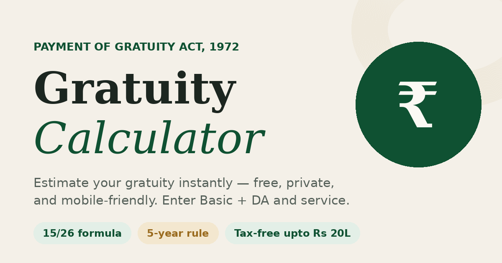

# Gratuity Calculator India

[](LICENSE)
[](https://gratuity-calculator-india.vercel.app/)
[](https://github.com/rohit-wadhwa/gratuity-calculator-india)

A free, open-source gratuity calculator for India under the **Payment of Gratuity Act, 1972**.

**[Use it live](https://gratuity-calculator-india.vercel.app/)**



## Features

- Instant gratuity estimation from Basic + DA and years of service
- Two input modes: enter joining/exit dates or completed years directly
- Covered (divides by 26) and uncovered (divides by 30) employer support
- Tax analysis with the Rs 20 lakh exemption under Section 10(10)
- Indian number formatting (lakh/crore grouping)
- Mobile-friendly, responsive design with 44px touch targets
- 100% client-side — **nothing is saved, sent, or tracked**
- SEO-optimized with JSON-LD structured data, Open Graph, and FAQ schema
- PWA-ready with web manifest

## How Gratuity Is Calculated

**Covered employers** (10+ employees):

```
Gratuity = (Last drawn Basic + DA) x 15 x (Completed years of service) / 26
```

**Uncovered employers:**

```
Gratuity = (Last drawn Basic + DA) x 15 x (Completed years of service) / 30
```

- Eligibility begins after **5 years** of continuous service (waived on death/disability)
- A final partial year **over 6 months** rounds up to a full year
- Up to **Rs 20,00,000** is tax-free under Section 10(10)

## Tech Stack

This is intentionally minimal:

- **Single HTML file** — markup, CSS, and JavaScript all in `index.html`
- **No framework**, no build step, no bundler, no package.json
- **No backend** — all computation runs in the browser
- **Hosted on [Vercel](https://vercel.com)** as a static site with security headers

## Project Structure

```
index.html          The entire app (markup + styles + logic + SEO)
vercel.json         Security headers (CSP, HSTS, X-Frame-Options, etc.)
og-image.png        1200x630 social share image
robots.txt          Crawler rules + sitemap pointer
sitemap.xml         Single-URL sitemap
site.webmanifest    PWA/mobile metadata
CLAUDE.md           AI assistant context for contributors using Claude Code
CONTRIBUTING.md     Contribution guidelines
LICENSE             MIT License
```

## Getting Started

No install needed. Download or clone and open `index.html` in any browser:

```bash
git clone https://github.com/rohit-wadhwa/gratuity-calculator-india.git
open gratuity-calculator-india/index.html
```

Or just [download the ZIP](https://github.com/rohit-wadhwa/gratuity-calculator-india/archive/refs/heads/main.zip), extract, and double-click `index.html`.

## Contributing

Contributions are welcome! Please read [CONTRIBUTING.md](CONTRIBUTING.md) before submitting a PR.

Key rules:
- Keep everything in `index.html` (single-file is intentional)
- Don't add frameworks, bundlers, or dependencies
- Don't add analytics, trackers, or anything that transmits user input
- Don't change the gratuity formula without a cited legal source
- Maintain mobile responsiveness and 44px minimum touch targets

## Privacy

This tool is 100% client-side. No data is collected, stored, transmitted, or tracked. The Content Security Policy in `vercel.json` enforces this. The only external resources loaded are Google Fonts.

## Support

Found this useful? Consider supporting further development:

[](https://buymeacoffee.com/rohit.wadhwa)

For issues and questions, see [SUPPORT.md](SUPPORT.md).

## License

[MIT](LICENSE) — free to use, modify, and distribute.

## Acknowledgements

- Built with vanilla HTML, CSS, and JavaScript
- Fonts: [Fraunces](https://fonts.google.com/specimen/Fraunces) and [DM Sans](https://fonts.google.com/specimen/DM+Sans) via Google Fonts
- Hosted on [Vercel](https://vercel.com)

---

**Disclaimer:** This tool is for illustration purposes only. Confirm your exact entitlement with your employer's HR/payroll department. This is not tax or legal advice.
